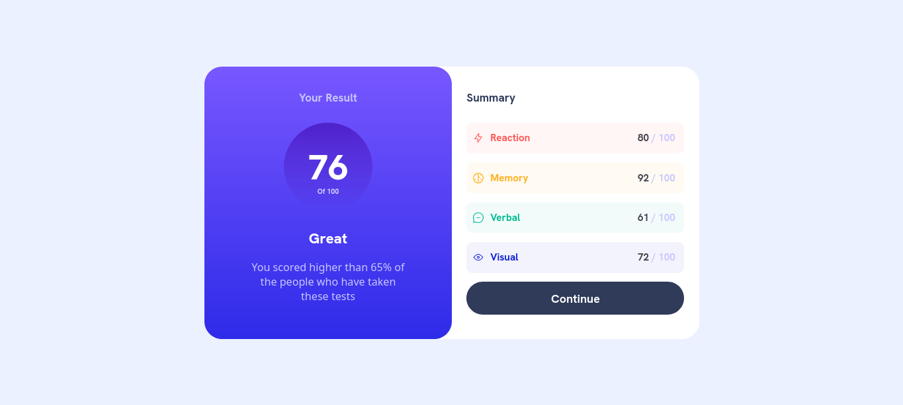

# Frontend Mentor - Results summary component solution

This is a solution to the [Results summary component challenge on Frontend Mentor](https://www.frontendmentor.io/challenges/results-summary-component-CE_K6s0maV). Frontend Mentor challenges help you improve your coding skills by building realistic projects. 

## Table of contents

- [Overview](#overview)
  - [The challenge](#the-challenge)
  - [Screenshot](#screenshot)
  - [Links](#links)
- [My process](#my-process)
  - [Built with](#built-with)
- [Author](#author)

## Overview

### The challenge

This project involves creating an interactive interface with the following requirements:

- **Responsive Design**: Ensure that the layout adapts seamlessly to different screen sizes, providing an optimal experience on any device (e.g., mobile, tablet, or desktop).
- **Interactive Elements**: Implement hover and focus states for all interactive components (such as buttons, links, or inputs) to enhance usability and accessibility.
- **Bonus Task**: Dynamically load and display content on the page using local JSON data, adding flexibility and interactivity to the application.

### Screenshot

### Links

- Solution link : [click here](https://www.frontendmentor.io/solutions/results-summary-component-vjvP4_FrgU)
  
- Live Site URL : [click here](https://alaa-mekibes.github.io/Results-summary-component-frontend-mentor)

## My process

### Built with

- Semantic HTML5 markup
- CSS custom properties
- Flexbox
- Media query

## Author

- Frontend Mentor - [@alaa-mekibes](https://www.frontendmentor.io/profile/alaa-mekibes)
- linkedin - [@alaa-mekibes](https://linkedin.com/in/alaa-mekibes)

